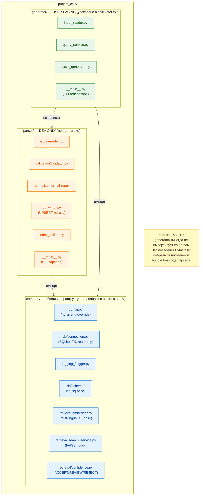
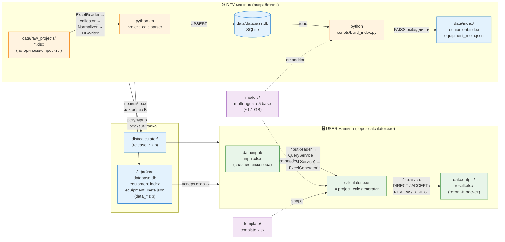
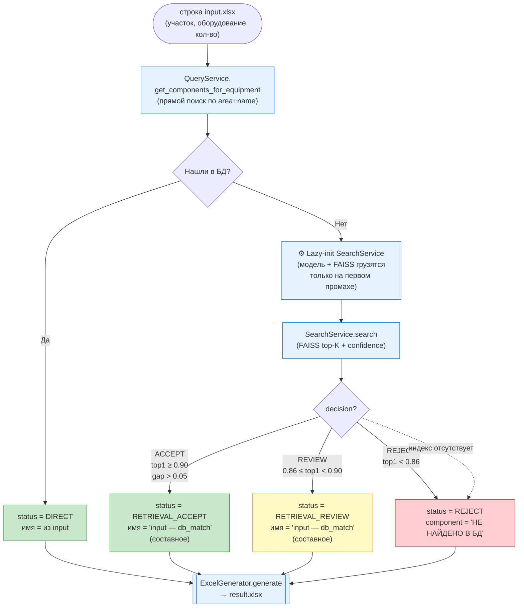
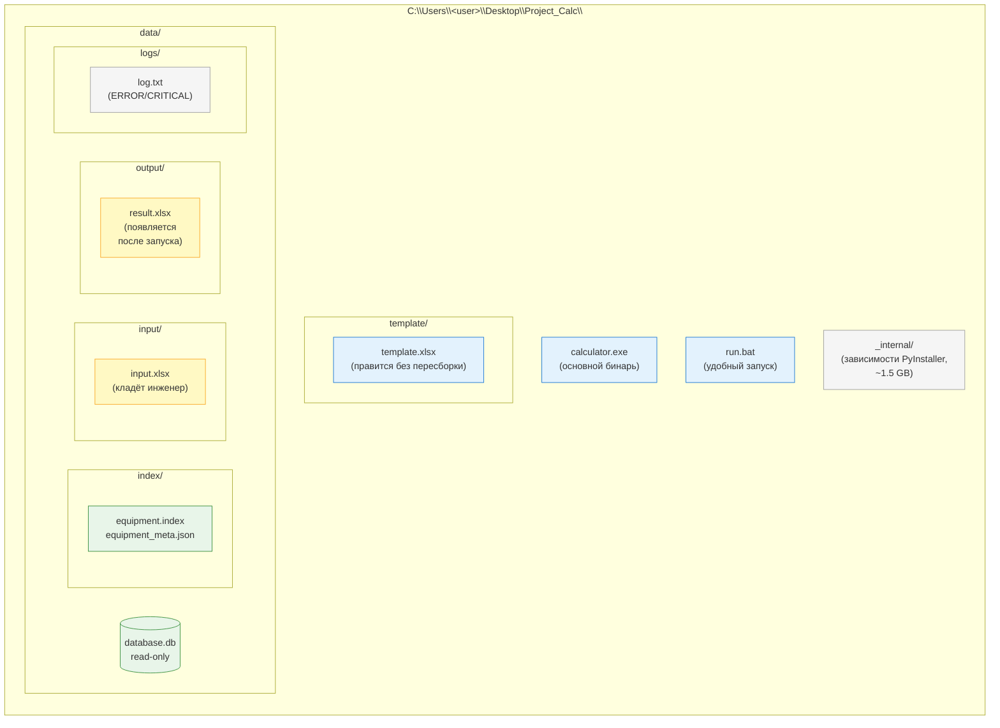
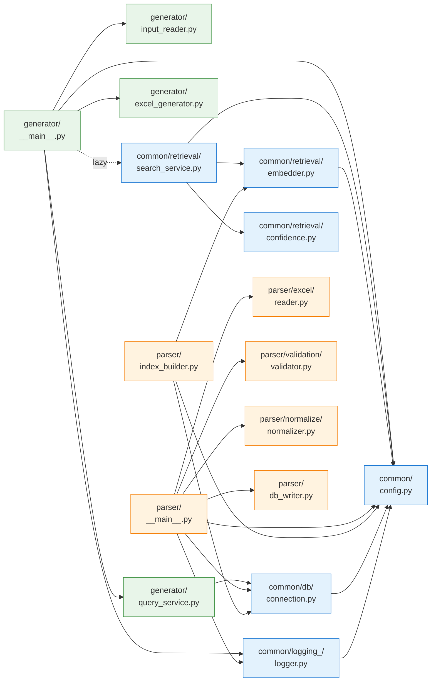

# ARCHITECTURE — Project Calc

Архитектурная блок-схема проекта в нескольких разрезах. Каждая диаграмма
отвечает на свой вопрос: «как устроен код», «куда движутся данные»,
«как собирается релиз», «что происходит при запуске генератора».

Диаграммы сделаны в Mermaid — GitHub рендерит их прямо в браузере.
Для правки достаточно открыть этот файл в любом текстовом редакторе.

---

## 1. Код-слои и инвариант `generator ↛ parser`



Три слоя. `common/` не зависит ни от чего внутри пакета. `parser/`
и `generator/` оба зависят от `common/`, но **не друг от друга** —
это и есть архитектурный инвариант, который позволяет PyInstaller
собрать exe без кода парсера.

---

## 2. Поток данных end-to-end



Стрелки пунктиром — это «ресурс, который используется», сплошные —
«данные текут вот сюда». БД и индекс готовятся на dev-машине и
доезжают до пользователя готовыми артефактами. Модель и шаблон
у пользователя статичны (приехали в bundle при установке).

---

## 3. Релизный pipeline

```mermaid
flowchart LR
    subgraph PREP["1. Подготовка артефактов"]
        direction TB
        INITDB[init_db.py]
        PARSER[python -m project_calc.parser]
        BIDX[build_index.py]
        BREL["build_release.py<br/>(оркестратор)"]

        BREL --> INITDB
        BREL --> PARSER
        BREL --> BIDX
    end

    subgraph PKG["2. Упаковка в exe"]
        direction TB
        SPEC[calculator.spec]
        PYINST["pyinstaller<br/>calculator.spec"]
        COPY["copy: template/,<br/>data/database.db,<br/>data/index/,<br/>run.bat"]
        PKGBAT["package_release.bat<br/>(оркестратор)"]

        PKGBAT --> SPEC
        SPEC --> PYINST
        PYINST --> COPY
    end

    subgraph DELIVER["3. Доставка"]
        direction TB
        DIST["dist/calculator/<br/>~1.5–2 GB"]
        ZIPA["data_YYYY-MM-DD.zip<br/>(релиз A — только данные)"]
        ZIPB["release_YYYY-MM-DD.zip<br/>(релиз B — весь bundle)"]
        USR["Project_Calc/<br/>на машине пользователя"]

        DIST --> ZIPB
        ZIPB --> USR
        ZIPA --> USR
    end

    PREP -->|при релизе B| PKG
    PKG --> DELIVER
    PREP -->|при релизе A<br/>(берём только 3 файла)| ZIPA

    SUPP["📋 Вспомогательные:<br/>download_model.py — раз на dev<br/>check_db.py — проверка содержимого<br/>calibrate_confidence.py — настройка порогов"]

    classDef step fill:#e3f2fd,stroke:#1976d2
    classDef orch fill:#fff9c4,stroke:#f9a825,stroke-width:2px
    classDef out  fill:#e8f5e9,stroke:#388e3c

    class INITDB,PARSER,BIDX,SPEC,PYINST,COPY step
    class BREL,PKGBAT orch
    class DIST,ZIPA,ZIPB,USR out
```

Два сценария релиза:
- **Релиз A** (часто) — данные обновились, exe не пересобираем. Берём
  три файла из `data/` после `build_release.py`, кладём в архив.
- **Релиз B** (редко) — меняли код или шаблон, пересобираем всё. Полный
  цикл `build_release.py → package_release.bat → release_*.zip`.

Подробности — [`RELEASE_PLAYBOOK.md`](RELEASE_PLAYBOOK.md).

---

## 4. Runtime-логика генератора (что происходит для каждой строки input)



Главные особенности:

- **Lazy-init** `SearchService` экономит 3–5 секунд старта, если БД покрывает всё прямым поиском.
- **Составное имя** при retrieval-подмене (Е.1.1) — инженер видит и свой запрос, и то, что подобралось из БД.
- **Четыре статуса** в `result.xlsx` (Е.1.2) — инженер фильтрует и работает только с теми строками, что требуют внимания.
- **Защита от отсутствующего индекса** — при `FileNotFoundError` от индекса генератор не падает, помечает строку как REJECT и идёт дальше.

Пороги confidence — в `common/retrieval/confidence.py`. Текущие значения
зафиксированы в Этапе Е.1.3.А (быстрый фикс, до полной калибровки на
~70-100 проектах в БД).

---

## 5. Структура файлов на машине пользователя



Зелёное — артефакты из релиза (приходят с dev-машины). Жёлтое —
пользовательское (создаётся при работе). Голубое — программа и
её конфигурация. Серое — служебное, не трогать.

---

## 6. Карта зависимостей внутри `project_calc/`



Видна та же история: всё опирается на `common/`, между `generator/`
и `parser/` стрелок нет.

---

## Легенда

| Цвет | Смысл |
|---|---|
| 🟢 Зелёный | `generator/` — то, что попадает в exe и работает у пользователя |
| 🟠 Оранжевый | `parser/` — dev-only, не уезжает к пользователю |
| 🔵 Голубой | `common/` — общая инфраструктура / артефакты / шаги pipeline |
| 🟡 Жёлтый | Заметки, оркестраторы, пользовательские артефакты |
| 🔴 Красный | Проблемные ветки (REJECT, отсутствие данных) |
| 🟣 Фиолетовый | Внешние ресурсы (модель, шаблон) |

---

## Связанные документы

- [`../README.md`](../README.md) — обзор проекта одной страницей.
- [`DEV_GUIDE.md`](DEV_GUIDE.md) — как запускать инструменты, опции CLI.
- [`USER_GUIDE.md`](USER_GUIDE.md) — инструкция для инженера-пользователя.
- [`RELEASE_PLAYBOOK.md`](RELEASE_PLAYBOOK.md) — процедура выпуска обновлений.
- [`../REFACTORING_PLAN.md`](../REFACTORING_PLAN.md) — архитектурные решения, история этапов, технические заметки.
